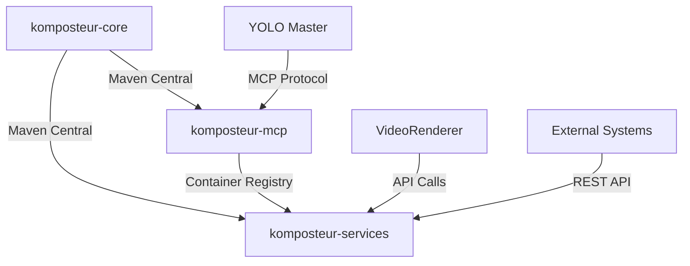

# Repository Split Architecture Strategy
## Decomposing Komposteur for Sister-Agent Coordination

### Executive Summary

The current monolithic Komposteur repository creates **circular dependency hell** and **cross-repository authentication complexity** that breaks sister-agent coordination. This document outlines a **microservice repository decomposition** strategy to create stable, independent subagents for the YOLO hierarchical multi-agent system.

### Current Architecture Problems

#### Monolithic Repository Issues
```
komposteur/ (single repository)
├── kobol/                    # Core composition engine
├── kompost/                  # Video processing logic  
├── kompost-mcp/             # MCP integration layer
│   ├── uber-kompost/        # Standalone JAR builder
│   └── komposteur-download-service/  # YouTube/S3 downloads
├── test-utils/              # Shared test utilities
└── standalone/              # Deployment artifacts
```

#### Problems with Current Structure
1. **Circular Dependencies**: kompost-mcp depends on kobol/kompost artifacts that don't exist yet in reactor build
2. **Build Complexity**: Requires multi-phase builds with complex choreography
3. **Authentication Hell**: Cross-repository dependencies require GitHub Packages auth in every workflow
4. **Coupling**: Changes to core affect MCP integration and vice versa
5. **Deployment Fragility**: Single repository failure affects all components

### Proposed Repository Architecture

#### 1. **komposteur-core** (Stable Foundation)
**Purpose**: Core video processing and composition engine

```
Repository: github.com/StigLau/komposteur-core
├── kobol/                   # Composition engine
├── kompost/                 # Video processing
├── test-utils/             # Shared utilities
└── .github/workflows/
    ├── ci.yml              # Build & test
    ├── release.yml         # Maven Central releases
    └── quality.yml         # Code quality gates
```

**Characteristics**:
- **Java 21 LTS**: Stable, no bleeding edge
- **Maven Central**: Public artifact distribution
- **Semantic versioning**: Clear API contracts
- **High stability**: 95%+ CI success rate target
- **Zero external dependencies**: Self-contained core

#### 2. **komposteur-mcp** (MCP Integration)
**Purpose**: MCP server integration and YOLO coordination

```
Repository: github.com/StigLau/komposteur-mcp
├── src/
│   ├── bridge/             # komposteur-core integration
│   ├── tools/              # MCP tool implementations
│   └── server/             # MCP server logic
├── integration/            # YOLO integration tests
└── .github/workflows/
    ├── ci.yml              # MCP-specific testing
    ├── integration.yml     # Sister-agent tests
    └── deploy.yml          # Container deployment
```

**Characteristics**:
- **Depends on**: komposteur-core (Maven Central)
- **Python-focused**: MCP server implementation
- **Container deployment**: Docker-based distribution
- **Integration testing**: Validates sister-agent coordination
- **API versioning**: Backward compatibility with YOLO

#### 3. **komposteur-services** (Deployment & Services)
**Purpose**: Production deployment and service orchestration

```
Repository: github.com/StigLau/komposteur-services
├── download-service/       # YouTube/S3 downloads
├── uber-kompost/          # Standalone JAR distribution
├── docker/                # Container definitions
├── kubernetes/            # K8s deployment manifests
└── .github/workflows/
    ├── build-services.yml  # Service builds
    ├── deploy-staging.yml  # Staging deployment
    └── deploy-prod.yml     # Production deployment
```

**Characteristics**:
- **Depends on**: komposteur-core, komposteur-mcp
- **Service-oriented**: Individual deployable services
- **Production-ready**: Full deployment automation
- **Monitoring**: Health checks, metrics, logging
- **Scalability**: Independent service scaling

### Dependency Flow Architecture

#### Clean Dependency Chain


#### Benefits of This Flow
- **No circular dependencies**: Clear dependency direction
- **Independent deployment**: Each repository can release independently
- **Stable integration points**: Well-defined API boundaries
- **Failure isolation**: Core stability independent of MCP or services

### Authentication Strategy

#### Current Problem: N×M Authentication Complexity
```
N repositories × M workflows = Authentication Hell
3 repos × 13 workflows = 39 auth configurations
```

#### Proposed Solution: Layered Authentication
```yaml
# komposteur-core: Public Maven Central (no auth)
distribute_to: maven_central
authentication: none

# komposteur-mcp: GitHub Packages (simple auth)
distribute_to: github_packages
authentication: GITHUB_TOKEN

# komposteur-services: Container Registry (service auth)
distribute_to: ghcr.io
authentication: container_registry_token
```

### Migration Strategy

#### Phase 1: Core Extraction (Month 1)
1. **Create komposteur-core repository**
2. **Extract kobol, kompost, test-utils**
3. **Establish Maven Central publishing**
4. **Create stable release (1.0.0)**
5. **Comprehensive test suite**

#### Phase 2: MCP Separation (Month 2)
1. **Create komposteur-mcp repository**
2. **Extract MCP integration code**
3. **Update to use komposteur-core 1.0.0**
4. **Implement sister-agent integration tests**
5. **Container-based deployment**

#### Phase 3: Services Decomposition (Month 3)
1. **Create komposteur-services repository**
2. **Extract download-service, uber-kompost**
3. **Service-oriented architecture**
4. **Production deployment automation**
5. **Monitoring and observability**

#### Phase 4: Legacy Cleanup (Month 4)
1. **Archive original monolithic repository**
2. **Update all documentation and references**
3. **Team training on new architecture**
4. **Performance and stability validation**

### Integration with Sister-Agent Architecture

#### Before Split: Monolithic Coupling
```
YOLO Master Agent
├── Komposteur Subagent (unstable, complex)
└── VideoRenderer Subagent (stable)

Problems:
- Komposteur failures cascade to YOLO
- Cross-repository authentication breaks coordination
- Deployment complexity affects all agents
```

#### After Split: Clean Separation
```
YOLO Master Agent
├── Komposteur-Core (stable foundation)
├── Komposteur-MCP (MCP integration)
└── VideoRenderer Subagent (stable)

Benefits:
- Independent failure domains
- Clean API boundaries
- Stable sister-agent coordination
- Independent deployment cycles
```

### Repository Ownership and Responsibilities

#### komposteur-core
- **Owner**: Core video processing team
- **SLA**: 99% uptime, <1% breaking changes
- **Release cycle**: Monthly stable releases
- **Backward compatibility**: 2-year guarantee

#### komposteur-mcp
- **Owner**: MCP integration team
- **SLA**: 95% uptime, rapid iteration allowed
- **Release cycle**: Weekly releases, semantic versioning
- **Integration testing**: Sister-agent compatibility

#### komposteur-services
- **Owner**: DevOps/platform team
- **SLA**: 99.9% production uptime
- **Release cycle**: Continuous deployment
- **Monitoring**: Full observability stack

### Success Metrics

#### Technical Metrics
- **Repository independence**: Zero cross-repo build dependencies
- **CI success rate**: 95%+ for each repository
- **Deployment frequency**: Independent release cadence
- **Mean time to recovery**: <30 minutes for any repository

#### Business Metrics
- **Sister-agent reliability**: 99% coordination success
- **Development velocity**: 50% faster feature delivery
- **Operational cost**: 30% reduction in CI/CD complexity
- **Team autonomy**: Independent team productivity

### Risk Assessment and Mitigation

#### High Risks
1. **Data migration complexity**: Moving code between repositories
2. **Dependency version conflicts**: Different teams updating at different rates
3. **Integration breakage**: Sister-agent coordination failures
4. **Team coordination**: Multiple repositories require more communication

#### Mitigation Strategies
1. **Gradual migration**: Incremental extraction with validation
2. **Contract testing**: API compatibility validation
3. **Integration monitoring**: Real-time sister-agent health checks
4. **Team structure**: Clear ownership and communication protocols

### Future Architecture Vision

#### Microservice Ecosystem
```
┌─────────────────┐    ┌─────────────────┐    ┌─────────────────┐
│ komposteur-core │    │ komposteur-mcp  │    │komposteur-services│
│ (Foundation)    │    │ (Integration)   │    │ (Deployment)    │
├─────────────────┤    ├─────────────────┤    ├─────────────────┤
│• Java 21 LTS    │    │• MCP Protocol   │    │• Container Svcs │
│• Maven Central  │    │• Python Bridge  │    │• K8s Deployment │
│• 99% Stability  │    │• Sister-Agent   │    │• Monitoring     │
│• Core APIs      │    │• Coordination   │    │• Scaling        │
└─────────────────┘    └─────────────────┘    └─────────────────┘
```

#### Integration Points
- **API-first design**: All communication through well-defined APIs
- **Event-driven architecture**: Loose coupling through events
- **Service mesh**: Advanced routing, security, observability
- **GitOps deployment**: Declarative infrastructure management

This repository split is **essential** for creating the stable foundations required for effective sister-agent coordination in the YOLO hierarchical multi-agent system.